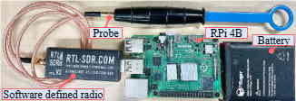
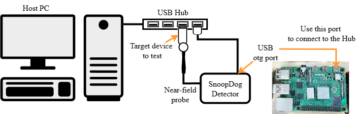

# SnoopDog: Detecting USB Bus Sniffers Using Responsive EMR

## SnoopDog Colab to test Method(Section 5) in the paper without hardwares
[Colab link](https://colab.research.google.com/drive/1Ihqmfy38Gr5L7T8ora8yWzIDwW8D2uRG?usp=sharing)
### Expected result of Colab
```bash
target data file to load =  ./recorded_data/benign1.data
8 fold record data has been loaded.
Detection result : False
	DTW distance: 5.0 

target data file to load =  ./recorded_data/benign2.data
8 fold record data has been loaded.
Detection result : False
	DTW distance: 5.0 

target data file to load =  ./recorded_data/malicious1.data
8 fold record data has been loaded.
Detection result : True
	DTW distance: 0.0 

target data file to load =  ./recorded_data/malicious2.data
8 fold record data has been loaded.
Detection result : True
	DTW distance: 0.0 
```
## Directory structure

```
SnoopDog\
├── artifact\
│   ├── detector\ <- Source codes for Detector
│   │   ├── recorded_data\
│   │   │   ├── benign1.data
│   │   │   ├── benign2.data
│   │   │   ├── malicious1.data
│   │   │   └── malicious2.data
│   │   ├── rtl_power_library\
│   │   │   ├── rtl-sdr\ <- library for rtl-sdr device
│   │   │   └── README.md
│   │   ├── requirements.txt
│   │   ├── client.py
│   │   └── detect_with_recorded_data.py
│   │   └── detector.py
│   │   └── pyrtl_power.py
│   ├── server\ <- Source codes for Server
│   │   ├── BaitPacketTransmitter.py
│   │   └── Server.py
│   └── Iso image
│   │   └── download_iso.sh
│   └── detector.zip <-- same as detector folder
│   └── server.zip <-- same as server folder
├── claim\
│   ├── recorded_data\
│   │   ├── benign1.data
│   │   ├── benign2.data
│   │   ├── malicious1.data
│   │   └── malicious2.data
│   ├── expected output.txt
│   ├── requirements.txt
│   ├── run.sh
│   └── snoopdog_detector.py
├── infrastructure\
│   └── colab_link.txt
└── README.md
```

## Source code description
### For SnoopDog detector
1. client.py
    
    Communication codes to send/receive commands from/to Host PC
1. detect_with_recorded_data.py
    
    Source code for detector including detection method in the paper. This program takes raw measurement of EMR signals from the USB device for detection.
    
    For details, please go to [Run Snoopdog with recorded data](##Run-Snoopdog-with-recorded-data)
1.  detector.py
    Source code for detector including detection method in the paper. This program requires real-world hardware environment.
### For Host PC
1. server.py
    
    Source code for Host PC including communication codes.
2. BaitPacketTransmitter.py
    
    Source code for transmitting bait traffic to Host PC.


## Hardware requirements

1. Raspberry Pi 4b or later with USB gadget functionallity
2. Auxiliary power for Raspberry Pi
3. RTL-SDR
4. Near-Field probe

Example of the detector hardware


```txt
Note: We use Pisugar external battery to power our RPi.
The power from USB connection from Host PC might be insufficient to operate the detector based on our experience.
```
## Software requirements for detector (Raspberry Pi)
1. Python 3.12 or later
2. numpy
3. scipy
4. fastdtw
5. Radio pi

## Software requirements for Host PC
1. Python 3.12 or later
2. RNDIS driver (if the detector is not recognized)

## Detector set-up
We provide two setup options:
1. Use iso image and flash to your RPi SD card to duplicate our detector.
2. Use your RPi and bring up manually.

### 1. use iso image and make sdcard to duplicate our detector
1. Navigate to Iso image
```bash
cd artifact/Iso image/
```
2. Download Snoopdog.img (the size of the image file is 12Gb)
```bash
bash ./run.sh
```
or
```bash
wget -c -O snoopdog.iso https://tinyurl.com/4pphfmb9
```

3. burn image into sdcard

&nbsp;&nbsp;&nbsp;&nbsp;&nbsp;&nbsp; for linux for Mac, use dd command

    1. Find your sdcard in your linux system. (you may use 'lsblk')
    2. Use dd to copy snoopdog.img to your sdcard.

```bash  
  sudo dd if=/dev/<your sdcard> of=snoopdog.img bs=4M status=progress conv=fsync
```

&nbsp;&nbsp;&nbsp;&nbsp;&nbsp;&nbsp; for Windows, you may use rufus

>&nbsp;&nbsp;&nbsp;&nbsp;&nbsp;&nbsp; Download [rufus](https://rufus.ie/) <br>
>&nbsp;&nbsp;&nbsp;&nbsp;&nbsp;&nbsp; Select your sd card and select snoopdog.img<br>
>&nbsp;&nbsp;&nbsp;&nbsp;&nbsp;&nbsp; Click start button<br>

2. plug your copied sdcard into your raspberry pi.

### 2. Use your raspberry pi and set up manually.
1. Download [pisdr](https://github.com/luigifcruz/pisdr-image) image on your SD card you may use dd or rufus
~~~bash  
  sudo dd if=/dev/<your sdcard> of=pisdr.img bs=4M status=progress conv=fsync
~~~
    
&nbsp;&nbsp;&nbsp;&nbsp;&nbsp;&nbsp; replace 'pisdr.img' with the actuall file name of the iso file downloaded from [pisdr](https://github.com/luigifcruz/pisdr-image)

2. Boot up your raspberry pi and access it using ssh for default ID/passwd check [pisdr](https://github.com/luigifcruz/pisdr-image).
3. install or check python 3.12
4. Download our detector source codes
```bash  
  wget https://github.com/MobiSec-CSE-UTA/SnoopDog/tree/main/artifact/detector.zip
  unzip ~/detector.zip
```
5. install requirements
```bash
cd ~/detector
python -m pip install -r requirements.txt
```
6. enable USB gadget g_ether
- Open Terminal on the RPi.
- Open the file `/boot/config.txt`.
- Add the following line:
  ```txt
  dtoverlay=dwc2
  ```
- Save and exit the file.
- Navigate to `/boot/cmdline.txt`.
- Add the following text **at the end of the line, after `rootwait`:**
  ```txt
  modules-load=dwc2,g_ether
  ```
- Save and exit the file.

- open /etc/dhcpcd.conf file.
- add following lines
  ```txt
    interface usb0
    static ip_address=192.168.7.2
  ```
- Save and exit the file.
- reboot your raspberry pi

## Host PC set-up
1. Download Our project for Host PC
```bash
wget https://github.com/MobiSec-CSE-UTA/SnoopDog/tree/main/artifact/server.zip
unzip server.zip
cd host
```

### Installing the RNDIS driver
Follow these instructions **only if your PC cannot recognize the RPi.**

##### For Windows PC:
1. Download the RNDIS driver from [Microsoft Update Catalog](https://www.catalog.update.microsoft.com/Search.aspx?q=usb%5Cvid_0525%26pid_a4a2).
2. Open **Device Manager** → navigate to **Other drivers** → **RNDIS/Ethernet Gadget** → right-click and select **Update Driver Software**.
3. Choose the file downloaded in step 1.
4. Reboot and reconnect all systems.

##### For Linux PC:
- The RPi will appear as a **network interface** automatically.


## Connect Snoopdog detector and Host PC



The detector should be recognized as a network interface when it is attached to Host PC.

Please follow the diagram above to connect the detector, a USB hub and Host PC.

## Run SnoopDog to detect a malicious sniffer

Upon connecting the detector & hub,
1. Locate the ipaddress of Host PC
```txt
for Windows, open Powershell/CMD → 'ipconfig'
for linux and Mac, open terminal → 'ifconfig'
```
If the SnoopDog detector is properly recognized, then your Host PC optains an ip address from the detector.
The ipaddress should be 192.168.7.xxx, the 'xxx' octet represents the Host PC

2. Run snoopdog server on Host PC
```bash
python server.py -p 5050
```

3. Open terminal and connect to the detector using ssh.
```bash
ssh snoopdog@192.168.7.2
```
the password is 'raspberry'

4. Run snoopdog_detector.py
```bash
python ./snoopdog_detector.py -i 192.168.7.<replace with your Host ip addrss> -p 5050
```
5. The program will display the result.


## Run Snoopdog with recorded data
For users who do not have the required hardware/environment for SnoopDog,
We provide a recorded raw EMR data to test SnoopDog.

### Requirements
- Python 3.12 or later

Please follow the steps mentioned here:

1. Download and unzip detector.zip by
```bash
wget https://github.com/MobiSec-CSE-UTA/SnoopDog/tree/main/artifact/detector.zip
unzip detector.zip
```
2. Navigate into the detector folder
```bash
cd  detector
```
3. Run code
To test recorded data from a malicious sniffer
```bash
python ./snoopdog_detect_with_recorded_data.py -d ./recorded_data/malicious1.data
```
To test recorded data from a benign device.
```bash
python ./snoopdog_detect_with_recorded_data.py -d ./recorded_data/malicious1.data
```
Or you may run without designation of the file.
```bash
python ./snoopdog_detect_with_recorded_data.py
```
in this case, the program will ask which option you want to test.
